# PixelCatsFork

## Project navigation

Use this quick map to find the main entry points in the repo:

- `PixelGame.sln` — open this solution to load all primary projects.
- `PixelBoardDisplay/` — shared display/input abstractions and board integration code.
- `ConsoleTest/` — console-hosted game runner and game implementations.
- `ConsoleTest.Tests/` — unit tests for console/game and API client behavior.
- `HerdingCats/` — standalone game project.
- `PixelCatsClient/` and `Client/` — Client applications.
- `shared/latest_score.json` — shared score output consumed by parts of the solution.

### Quick start by goal

- **Run core console game loop**: start in `ConsoleTest/Program.cs`.
- **Work on board rendering or Arduino integration**: start in `PixelBoardDisplay/`.
- **Run or add tests**: start in `ConsoleTest.Tests/`.

---

## Prerequisites

- .NET SDK 9.x
- Visual Studio 2022 (optional)

## Build / run / test

From the repo root:

```sh
dotnet build PixelGame.sln
dotnet run --project ConsoleTest/ConsoleTest.csproj
dotnet test
```

## Configuration (ConsoleTest)

`ConsoleTest` loads configuration from `appsettings.json` (optional) and environment variables.

- `UseEmulator` (bool) – defaults to `true`
- `Leaderboard:BaseUrl` (string) – defaults to `http://127.0.0.1:3000`
  - environment variable form: `Leaderboard__BaseUrl`
- HMAC secrets (strings):
  - `LEADERBOARD_HMAC_SNAKE`
  - `LEADERBOARD_HMAC_TETRIS`
  - `LEADERBOARD_HMAC_EDU`

Score export:

- `ConsoleTest` writes `shared/latest_score.json` (relative to the repo root when possible).

## Adding a new game (ConsoleTest)

- Implement `ConsoleTest/Games/IGame.cs`
- Register the game in `ConsoleTest/Program.cs` (the `games` dictionary)

---

Below are class diagrams (in Mermaid format) for all major classes and interfaces in the **PixelBoard** project.  

---

### ArduinoDisplay

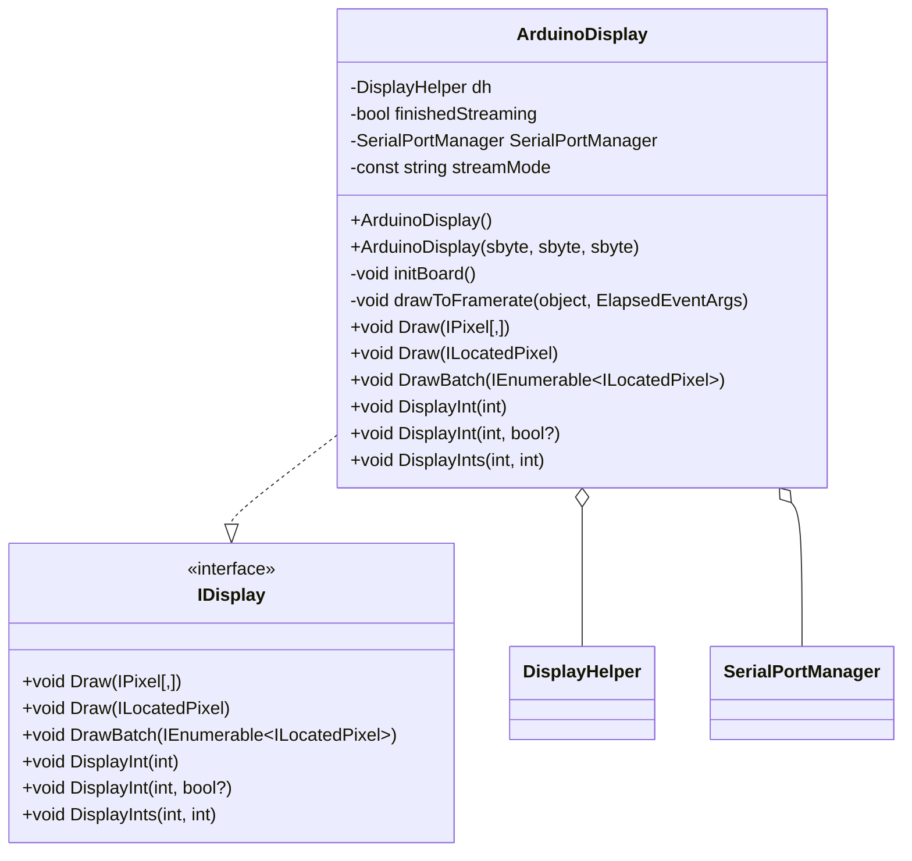

---

### ArduinoInput

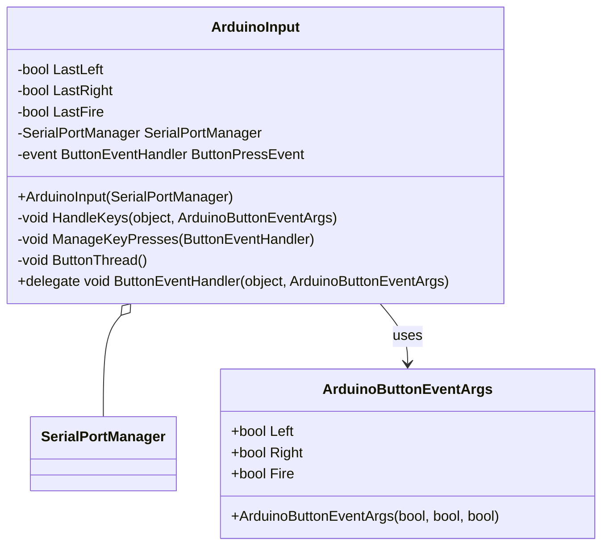

---

### ConsoleDisplay

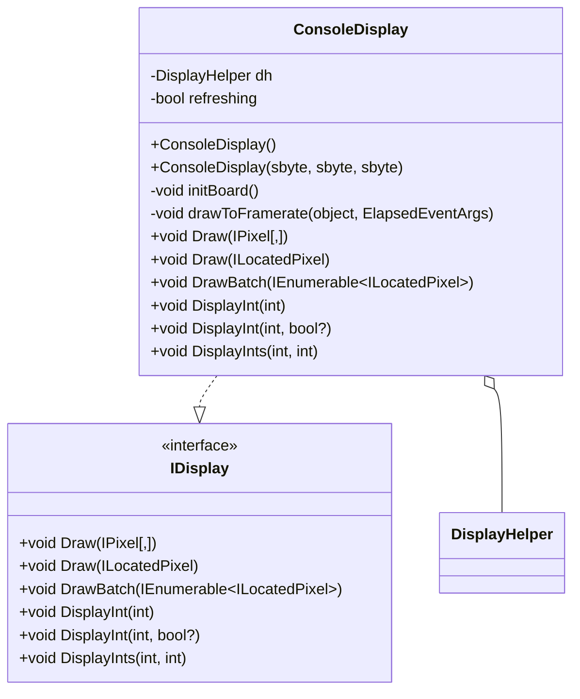

---

### DisplayHelper

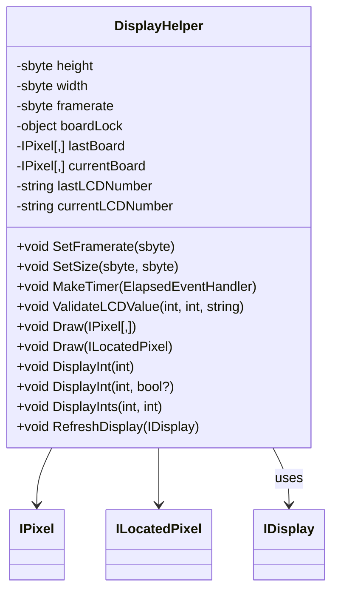

---

### IArduinoInput

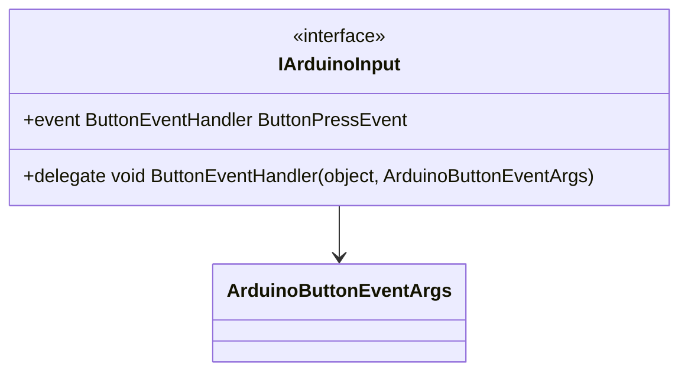

---

### IDisplay

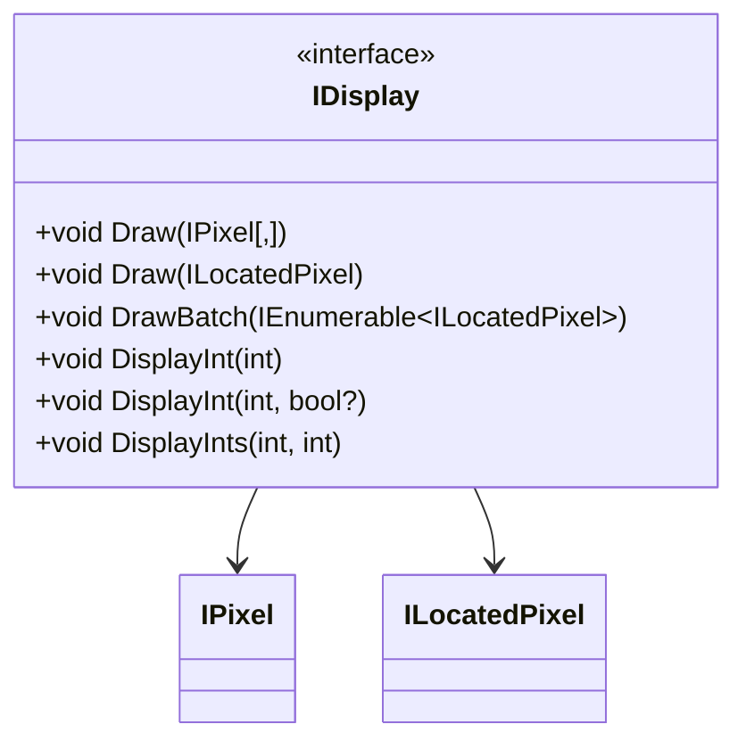

---

### ILocatedPixel

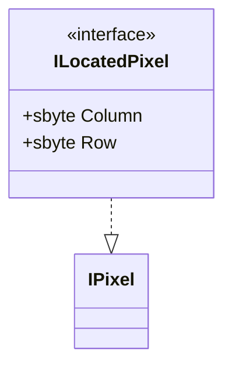

---

### IPixel

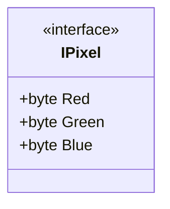

---

### LocatedPixel

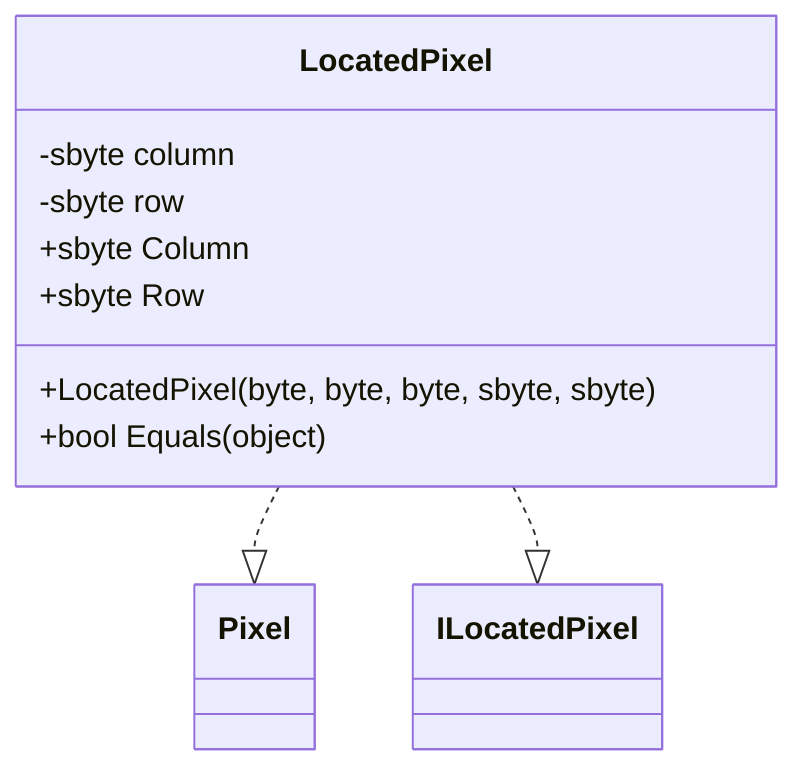

---

### Pixel

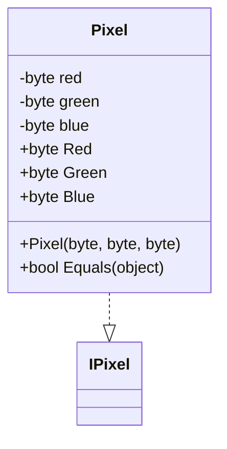

---

### SerialPortManager

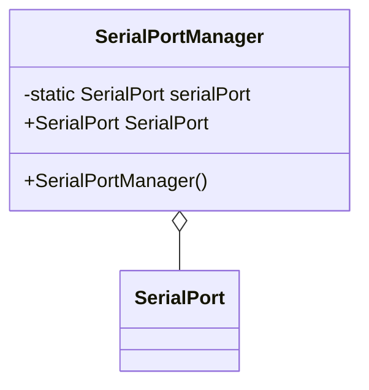